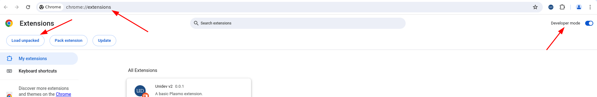
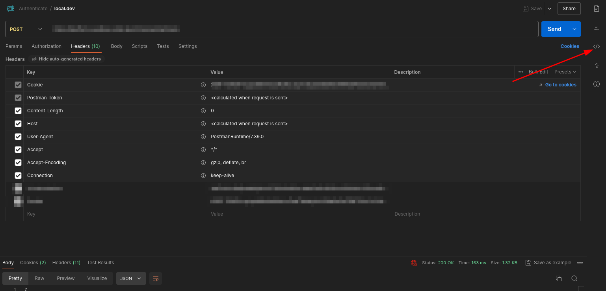
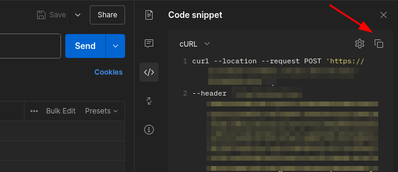
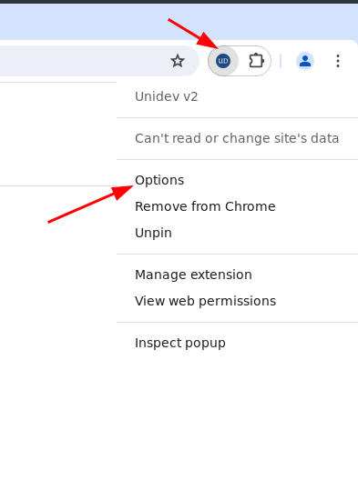

# UniDev Browser Extension

This is a [Plasmo extension](https://docs.plasmo.com/) project bootstrapped with [`plasmo init`](https://www.npmjs.com/package/plasmo).
Currently, it supports Firefox and Chrome, as well as all browsers based on Firefox or Chromium/Chrome. Future releases will expand support to additional browsers.

## Installation

### Download the plugin

- Download the build plugin for your browser from the [releases](https://github.com/nick-nds/UniDev/releases) page.
- Extract the downloaded ZIP file.

### For Chrome
- Go to [chrome://extensions/](chrome://extensions) in chrome.
- Enable **Developer mode**.
- Select the **Load unpacked** option and browse to the extracted folder to load the plugin. 

### For Firefox
- Navigate to about:debugging#/runtime/this-firefox in Firefox.
- Click on **Load Temporary Add-on**.
- Select the manifest file from the extracted folder.

## Usage

### Unify Login
- Copy the Unify curl script for login.
- To obtain the curl script from Postman:
    - Open the **Code** option of your Login request in Postman. 
    - Copy the curl script from **Code snippet** of your Postman request. 
- Open the Options page of the plugin by right-clicking on the plugin icon and selecting **Options**. 
- Paste the curl script to add login information for that domain.
- You can now login to the domain using the plugin.

##### More features will be added in future releases.

## Contribution
We welcome all contributions. Please follow the guidelines below to set up a development environment.

### Development

First, run the development server:

```bash
pnpm dev
# or
npm run dev
```

Open your browser and load the appropriate development build. For example, if you are developing for the chrome browser, using manifest v3, use: `build/chrome-mv3-dev`.

For further guidance, please refer to the [Plasmo Documentation](https://docs.plasmo.com/)

### Making production build

To create a production bundle, run the following command:

```bash
pnpm build
# or
npm run build
```

This will generate a production-ready bundle for your extension, which can be zipped and published. Refer to the [Plasmo Documentation](https://docs.plasmo.com/) for more build options.


Thank you for your interest in contributing to the UniDev Browser Extension. We look forward to your valuable input and enhancements.
